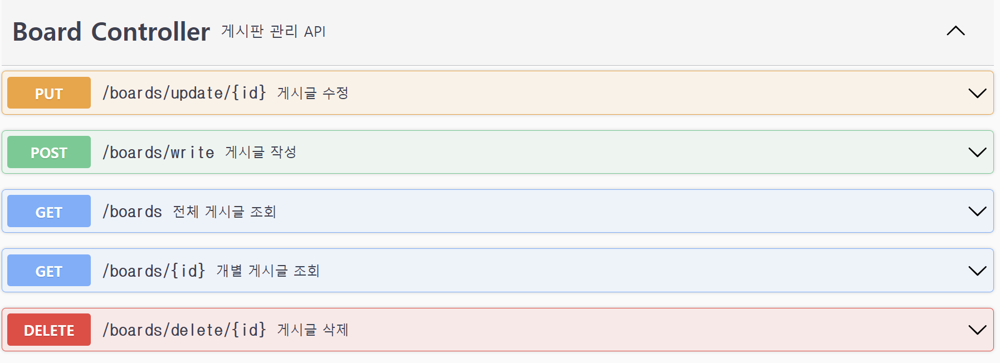

# RESTful를 이용한 게시판 만들기 프로젝트
### &Dotori Backend 과제입니다

### 실행화면
+ 게시판 글 작성
    
+ 게시판 글 전체 조회
  
+ 게시판 글 개별 조회
  
+ 게시판 글 수정
  
+ 게시판 글 삭제
  
+ 회원가입
    
+ 전체 회원 조회(로그인 프로세스)
    
+ 개별 회원 조회(로그인 프로세스)
    

### API 명세

### 참고자료
+ [쉽게 Rest API를 만들어보기(로그인, DTO, 예외 처리, JSON 리턴)](https://m.blog.naver.com/PostView.naver?blogId=sosow0212&logNo=222727249905&fromRecommendationType=category&targetRecommendationDetailCode=1000)
+ [쉽게 Rest API를 만들어보기(JPA로 게시판 구현하기 및 유저 정보 넣기, Dto로 데이터를 예쁘게 받자)](https://m.blog.naver.com/PostView.naver?blogId=sosow0212&logNo=222728795428&fromRecommendationType=category&targetRecommendationDetailCode=1000)
